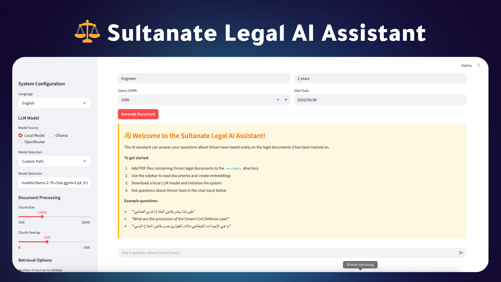

# 🏛️ Sultanate Legal AI Assistant 🤖⚖️

<div align="center">
  
  
  
  
  
  
</div>

<h1 align="center">Sultanate Legal AI Assistant</h1>

<p align="center">An advanced system for intelligent search, legal analysis, and report generation based on Omani laws, with support for both Arabic and English languages, voice interaction, and legal document generation.</p>

<p align="center">
  
</p>

<p align="center">
  
</p>

## 📋 Table of Contents

- [🔍 Overview](#overview)
- [🔎 Features](#features)
  - [Level 1: Intelligent Search Bot](#level-1-intelligent-search-bot)
  - [Level 2: Legal Article Extraction](#level-2-legal-article-extraction)
  - [Level 3: Law Comparison and Voice Interaction](#level-3-law-comparison-and-voice-interaction)
  - [Level 4: Legal Document Generation](#level-4-legal-document-generation)
  - [Level 5: Intelligent Reports and Case Analysis](#level-5-intelligent-reports-and-case-analysis)
- [🌟 New Features](#new-features)
  - [OpenRouter Integration](#openrouter-integration)
  - [Voice Recognition Improvements](#voice-recognition-improvements)
  - [UI Enhancements](#ui-enhancements)
- [💻 System Requirements](#system-requirements)
- [⚙️ Installation and Setup](#installation-and-setup)
- [🚀 Usage](#usage)
- [💡 Examples](#examples)

## Overview

The Sultanate Legal AI Assistant is a comprehensive legal assistant designed for Omani laws. It combines advanced AI technologies to provide accurate answers, legal document analysis, voice interaction, and document generation capabilities. The system supports both Arabic and English languages, making it accessible to a wider audience.

## Features

- **Intelligent Search**: Search and answer questions based on Omani legal documents
- **Legal Document Analysis**: Extract and analyze specific articles and sections from legal texts
- **Law Comparison**: Compare different laws and identify similarities and differences
- **Voice Interaction**: Interact with the system using voice commands and queries
- **Document Generation**: Create legal documents based on user requirements
- **Multi-language Support**: Full support for both Arabic and English

## New Features

### OpenRouter Integration
- Added support for OpenRouter API to access powerful language models
- Automatic model selection and fallback mechanisms
- Enhanced response quality for legal queries

### Voice Recognition Improvements
- Integrated Vosk for offline voice recognition
- Added automatic model downloading
- Enhanced voice processing capabilities
- Improved error handling and user feedback

### UI Enhancements
- Reorganized interface for better user experience
- Clear sections for different functionalities
- Improved visual feedback and styling
- Better organization of system components

## System Requirements

<table>
  <tr>
    <th>Requirement</th>
    <th>Details</th>
  </tr>
  <tr>
    <td>Programming Language</td>
    <td>Python 3.10 or newer</td>
  </tr>
  <tr>
    <td>Memory</td>
    <td>8GB minimum (16GB recommended)</td>
  </tr>
  <tr>
    <td>Storage</td>
    <td>10GB minimum</td>
  </tr>
  <tr>
    <td>Operating System</td>
    <td>Windows 10/11, macOS 12+, or Linux</td>
  </tr>
  <tr>
    <td>Optional</td>
    <td>GPU for accelerating language models</td>
  </tr>
</table>

## Installation and Setup

### Step 1: Clone the Repository

```bash
# Clone the repository from GitHub
git clone https://github.com/alanqoudif/Ankaa.git

# Navigate to the project directory
cd Ankaa
```

### Step 2: Create a Virtual Environment

```bash
# Create a virtual environment
python -m venv venv

# Activate the virtual environment
# On Windows
venv\Scripts\activate
# On macOS/Linux
source venv/bin/activate
```

### Step 3: Install Requirements

```bash
# Install required libraries
pip install -r requirements.txt
```

### Step 4: Set Up Environment File

```bash
# Create .env file
touch .env
```

Add the following environment variables to the `.env` file:

```
# Example .env file

# Required: OpenRouter API key (get yours at https://openrouter.ai)
OPENROUTER_API_KEY=your_openrouter_api_key_here

# Optional: Specify default model
# Available models include: openai/gpt-4-turbo, anthropic/claude-3-opus, google/gemini-pro
DEFAULT_MODEL=openai/gpt-4-turbo

# Optional: Voice settings
# Path to Vosk model for offline voice recognition
VOICE_MODEL_PATH=./models/vosk-model-small-ar

# Text-to-speech engine (options: pyttsx3 for offline, gtts for online)
TEXT_TO_SPEECH_ENGINE=pyttsx3

# Optional: Debug mode
DEBUG_MODE=false
```

You can get an OpenRouter API key by signing up at [OpenRouter.ai](https://openrouter.ai/).

### Step 5: Run the Application

```bash
# Run the application
streamlit run src/app.py
```

After running the command, the browser will automatically open at `http://localhost:8501`

## Project Structure

```
.
├── README.md
├── requirements.txt
├── src
│   ├── app.py                     # Main entry point for the application
│   ├── data/                      # Folder for legal documents
│   ├── document_loader.py         # Document loading and parsing functions
│   ├── document_structure.py      # Document structure definitions
│   ├── embeddings.py              # Vector embeddings creation
│   ├── llm_chain.py               # LLM chain for Q&A
│   ├── models/                    # Folder for language and embedding models
│   ├── retriever.py               # Relevant document retrieval
│   ├── setup.py                   # Project setup
│   ├── ui/                        # User interface components
│   │   ├── components.py          # Basic UI components
│   │   ├── document_components.py # Document generation components
│   │   └── voice_components.py    # Voice interaction components
│   └── utils/                     # Helper functions
│       ├── arabic_utils.py        # Arabic language processing
│       ├── case_analysis_utils.py # Legal case analysis
│       ├── comparison_utils.py    # Law comparison
│       ├── document_generation_utils.py # Document generation
│       ├── document_utils.py      # Document processing
│       ├── image_generation_utils.py # Document image generation
│       ├── model_utils.py         # Model management
│       ├── ollama_utils.py        # Ollama integration
│       └── voice_utils.py         # Voice processing
└── chroma_db/                     # ChromaDB database
```

## Usage

### Quick Start Guide

<table>
  <tr>
    <th>Step</th>
    <th>Description</th>
  </tr>
  <tr>
    <td><strong>1. Prepare Documents</strong></td>
    <td>Place Omani legal documents (in PDF format) in the <code>src/data/</code> folder</td>
  </tr>
  <tr>
    <td><strong>2. Run the Application</strong></td>
    <td>Run the application using the command <code>streamlit run src/app.py</code></td>
  </tr>
  <tr>
    <td><strong>3. Set Up the System</strong></td>
    <td>Click the <strong>"Set Up All"</strong> button to load documents, create embeddings, and initialize the system in one go</td>
  </tr>
  <tr>
    <td><strong>4. Use the System</strong></td>
    <td>Use the chat interface to ask questions and use various features</td>
  </tr>
</table>

### System Features and How to Use Them

<details>
<summary>🔍 <strong>Search for Legal Information</strong></summary>
<p>Type your question in the chat box in Arabic or English such as:</p>
<ul>
  <li>"What is the penalty for theft according to Omani laws?"</li>
  <li>"What are the requirements for establishing a company in Oman?"</li>
</ul>
</details>

<details>
<summary>📝 <strong>Extract Specific Legal Articles</strong></summary>
<p>Request a specific legal article by mentioning its number and the law it belongs to:</p>
<ul>
  <li>"Show me Article 150 of the Omani Penal Code"</li>
  <li>"Show me Article 25 of the Omani Labor Law"</li>
</ul>
</details>

<details>
<summary>🔄 <strong>Compare Laws</strong></summary>
<p>Use the word "compare" in your question to compare laws or articles:</p>
<ul>
  <li>"Compare the Labor Law and Civil Service Law regarding vacations"</li>
  <li>"Compare the regulations for commercial companies between different Omani laws"</li>
</ul>
</details>

<details>
<summary>🎤 <strong>Voice Interaction</strong></summary>
<p>Use the dedicated buttons for voice interaction:</p>
<ul>
  <li>Click the <strong>"Voice Input"</strong> button to ask your question by voice</li>
  <li>Click the <strong>"Read Aloud"</strong> button to hear the answer</li>
</ul>
</details>

<details>
<summary>📄 <strong>Create Legal Documents</strong></summary>
<p>Use the "Generate Documents" section to create legal documents such as:</p>
<ul>
  <li>Employment contracts</li>
  <li>Lease agreements</li>
  <li>Service contracts</li>
  <li>Legal authorizations</li>
</ul>
</details>

<details>
<summary>📊 <strong>Analyze Legal Scenarios and Generate Reports</strong></summary>
<p>Present a realistic legal scenario and request its analysis and PDF report generation:</p>
<ul>
  <li>"A citizen invested money abroad without declaring it to Omani authorities. What are the legal implications?"</li>
  <li>"A company terminated an employee without prior notice. What are the employee's rights according to Omani law? I need a PDF report"</li>
</ul>
</details>

## Examples

<div style="display: flex; flex-wrap: wrap; gap: 20px; justify-content: space-between;">

<div style="flex: 1; min-width: 300px; background-color: #f8f9fa; padding: 15px; border-radius: 8px; margin-bottom: 20px; border-left: 4px solid #1E3A8A;">
<h3>🔎 Searching for Legal Information</h3>

```
What is the penalty for theft according to Omani laws?
```

```
What are the requirements for establishing 
a company in Oman?
```

```
What are the requirements for obtaining Omani citizenship?
```
</div>

<div style="flex: 1; min-width: 300px; background-color: #f0f7ff; padding: 15px; border-radius: 8px; margin-bottom: 20px; border-left: 4px solid #0369a1;">
<h3>📑 Extract Specific Legal Articles</h3>

```
Show me Article 150 of the Omani Penal Code
```

```
Show me Article 25 of the Omani Labor Law
```

```
What is Article 10 of the Commercial Companies Law?
```
</div>

<div style="flex: 1; min-width: 300px; background-color: #f0fff4; padding: 15px; border-radius: 8px; margin-bottom: 20px; border-left: 4px solid #166534;">
<h3>🔄 Compare Laws</h3>

```
Compare the Labor Law and Civil Service Law regarding vacations
```

```
Compare the regulations for commercial 
companies between different Omani laws
```
</div>

<div style="flex: 1; min-width: 300px; background-color: #fff7ed; padding: 15px; border-radius: 8px; margin-bottom: 20px; border-left: 4px solid #c2410c;">
<h3>🎤 Voice Interaction</h3>

<p>• Click the <strong>"Voice Input"</strong> button and ask your question verbally</p>

<p>• Click the <strong>"Read Aloud"</strong> button to hear the answer</p>
</div>

<div style="flex: 1; min-width: 300px; background-color: #faf5ff; padding: 15px; border-radius: 8px; margin-bottom: 20px; border-left: 4px solid #7e22ce;">
<h3>📝 Create Legal Documents</h3>

<p>Use the "Generate Documents" section to create:</p>

<ul>
  <li>Employment contracts</li>
  <li>Lease agreements</li>
  <li>Service contracts</li>
  <li>Legal authorizations</li>
</ul>
</div>

<div style="flex: 1; min-width: 300px; background-color: #f0f9ff; padding: 15px; border-radius: 8px; margin-bottom: 20px; border-left: 4px solid #0284c7;">
<h3>📊 Scenario Analysis and Report Generation</h3>

```
A citizen invested money abroad without declaring it to Omani authorities. What are the legal implications? I need a PDF report.
```

```
A company terminated an employee without prior notice. What are the employee's rights according to Omani law?
```
</div>

</div>
</div>

## New Features

### OpenRouter Integration
- Added support for OpenRouter API to access powerful language models
- Automatic model selection and fallback mechanisms
- Improved response quality for legal queries

### Voice Recognition Improvements
- Integrated Vosk for offline voice recognition
- Added automatic model downloading
- Enhanced voice processing capabilities
- Improved error handling and user feedback

### UI Enhancements
- Reorganized interface for better user experience
- Clear sections for different functionalities
- Improved visual feedback and styling
- Better organization of system components
